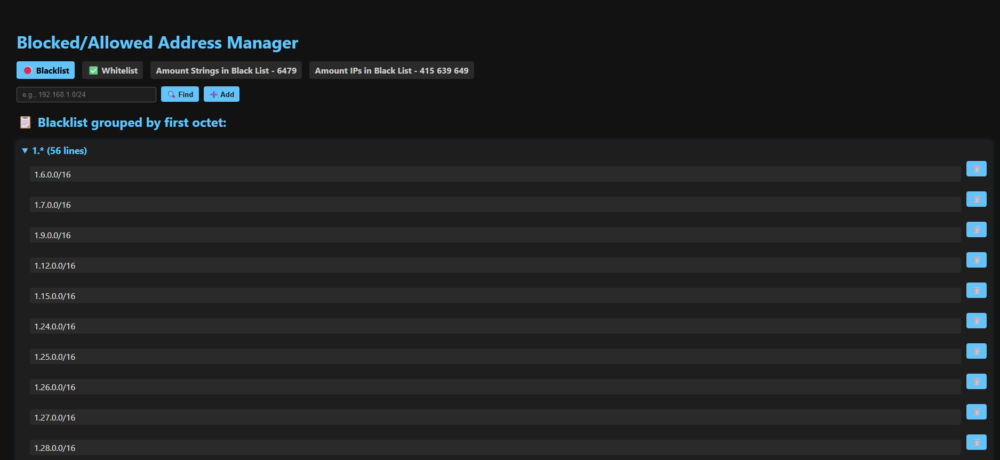

# Flask IP Manager

A simple Flask web app to manage Blacklist and Whitelist IP networks, with flexible search and grouping features.

---

## Features

- Manage Blacklist and Whitelist IP/CIDR entries  
- Flexible search by partial IP, full IP, or IP contained in a network  
- Grouped display by first octet with collapsible sections  
- Highlight and scroll to matched IPs  
- Add/Delete IP networks  
- Runs inside Docker for easy deployment  
- Reverse proxy via NGINX supported  

---

## Getting Started

### Prerequisites

- Docker installed on your system  
- (Optional) NGINX server for reverse proxy  

---

### Build and Run Docker Container

1. Clone or download the project source.

2. Build the Docker image:

```bash
docker build -t ip-manager .
